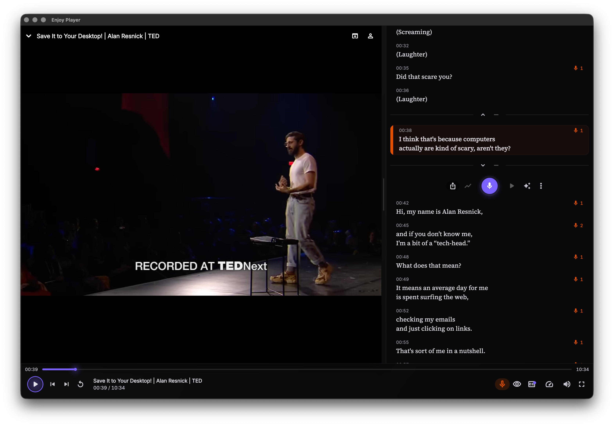

<p align="right">
  <b>English</b> · <a href="README.zh-CN.md">简体中文</a>
</p>

<p align="center">
  
</p>

<h1 align="center">Enjoy Player</h1>

<p align="center">
  <strong>Practice languages with media you love.</strong>
  <br>
  Interactive transcripts, echo shadow-reading, pronunciation scoring and an SRS vocabulary book — on every device you own.
</p>

<p align="center">
  <a href="https://player.enjoy.bot"></a>
  <a href="https://github.com/baizhiheizi/enjoy_player/releases/latest"></a>
  <a href="LICENSE"></a>
</p>

---

## See it in action

<table>
  <tr>
    <td align="center" width="25%"></td>
    <td align="center" width="25%"></td>
    <td align="center" width="25%"></td>
    <td align="center" width="25%"></td>
  </tr>
  <tr>
    <td align="center"><b>Stay motivated</b><br><sub>Daily goal · Community · Recents</sub></td>
    <td align="center"><b>Follow every word</b><br><sub>Tap-to-seek · Echo mode</sub></td>
    <td align="center"><b>Speak like a native</b><br><sub>Azure pronunciation scoring</sub></td>
    <td align="center"><b>Build vocabulary</b><br><sub>Look up · Save · Review with SRS</sub></td>
  </tr>
</table>

<p align="center">
  
</p>

<p align="center"><sub><b>One experience, every screen.</b> Native on Windows, macOS, Linux, Android and iOS — phone, tablet and desktop.</sub></p>

---

## Why Enjoy Player

**Learn with content you actually enjoy.** Bring your own MP4s and audio files, or paste any YouTube URL — TED talks, Netflix shows, podcasts, anime. The transcript follows your media, not the other way around.

**Speak from day one.** Echo mode listens to a single line, records you reading it back, then scores your pronunciation on accuracy, fluency, completeness and prosody. You don't need a language partner to practise.

**Vocabulary that actually sticks.** Highlight any word in the transcript and get an instant translation, dictionary definition and an LLM-powered explanation of what the phrase means in this scene. One tap saves it to a spaced-repetition deck that reviews on the schedule your brain needs.

**One app, every device.** Native builds for Windows, macOS, Linux, Android and iOS. Library, progress, vocabulary and settings follow you everywhere, with optional cloud sync.

**Stay in the game.** A daily practice goal, a community of learners practising alongside you, and progress stats that show you're getting better — one cue at a time.

---

## Core features

- **Interactive transcripts** — Auto-synced subtitles from `.srt` / `.vtt` imports, AI transcription or YouTube captions. Tap any line to jump; tap any word to look it up.
- **Echo mode (shadow reading)** — Listen, record, replay. The player pauses at the end of your echo segment and rewinds, so you can drill the same line again without breaking flow.
- **Pronunciation assessment** — Native Azure speech scoring per take: overall score plus accuracy / completeness / fluency / prosody, with per-word detail and replay.
- **Dictionary & contextual translation** — Highlight text in the transcript → translation, dictionary entry, and an LLM-generated "what does this phrase mean here?" explanation.
- **Spaced-repetition vocabulary** — 3-button flashcards (Don't know / Know / Know well) on a 3-rating SM-2 schedule, with multi-context per word and Anki CSV export (Pro).
- **YouTube playback** — Paste a URL and play. Enjoy caches captions, fetches metadata and renders the transcript alongside — no ads, no autoplay surprises.
- **Pitch contour analysis** — Compare your recorded take's intonation against the original line on a YIN-pitch chart. See exactly where your tone drifts.
- **Practice poster** — Turn a shadow-reading take into a branded 9:16 poster (cover frame, hero line, stats) and share it to WeChat, X or anywhere.
- **AI auto-translate** — Per-line translations on demand, cached locally, refreshed automatically when the source text changes.
- **Cross-device sync** — Library, progress, vocabulary and settings sync across every device signed in to your Enjoy account.

---

## Built for every screen

| Platform | What's native |
| ---------- | --------------- |
| **Windows** | Windows 10 / 11 · x64 · FFmpeg embedded for subtitles and pitch analysis |
| **macOS** | macOS 10.15+ · Universal binary · Hardened runtime · Notarized |
| **Linux** | Ubuntu 22.04 LTS · x86_64 · AppImage |
| **Android** | Android 8.0+ · Phone & tablet · Play Store and direct APK sideload |
| **iOS** | iOS 14.0+ · iPhone & iPad · TestFlight public beta |

Flutter web is intentionally not supported.

---

## Get it now

The download page picks the right installer for your OS automatically:

**[player.enjoy.bot](https://player.enjoy.bot)**

| | |
| --- | --- |
| Windows | [Download .exe](https://player.enjoy.bot) |
| macOS | [Download .dmg](https://player.enjoy.bot) |
| Linux | [Download .AppImage](https://player.enjoy.bot) |
| Android | [APK (direct)](https://player.enjoy.bot) · [Join Play beta](https://play.google.com/) |
| iOS | [Join TestFlight beta](https://testflight.apple.com/join/6x7kkr3e) |

Source, releases and changelog: **[github.com/baizhiheizi/enjoy_player](https://github.com/baizhiheizi/enjoy_player)**

---

## Open source & built with care

- **Player** — [media_kit](https://pub.dev/packages/media_kit) on a single shared engine ([ADR-0003](docs/decisions/0003-player-engine.md))
- **State** — [Riverpod 3](https://pub.dev/packages/flutter_riverpod) + `riverpod_annotation`
- **Storage** — [Drift](https://pub.dev/packages/drift) (SQLite) for every persisted byte
- **Speech** — Azure pronunciation assessment + native FFmpeg pitch analysis
- **Architecture** — See [docs/architecture.md](docs/architecture.md); decisions in [docs/decisions/](docs/decisions/)

---

## Build from source

```bash
flutter pub get
dart run build_runner build   # after Drift / Riverpod annotation changes
flutter run
```

Platform toolchain notes: macOS needs Xcode + CocoaPods + `brew bundle install --file=macos/Brewfile`; Windows needs the NuGet CLI on `PATH` for `flutter_inappwebview`; Linux needs `clang cmake ninja-build libgtk-3-dev libsqlite3-dev ffmpeg`. Full prerequisites and CI gates: [AGENTS.md](AGENTS.md).

---

## License

Released under the [GNU Affero General Public License v3.0](LICENSE) (AGPL-3.0). You can read it, fork it, build on it, and even run a modified copy — as long as anyone you serve over the network gets the corresponding source. See [LICENSE](LICENSE) for the full text.
