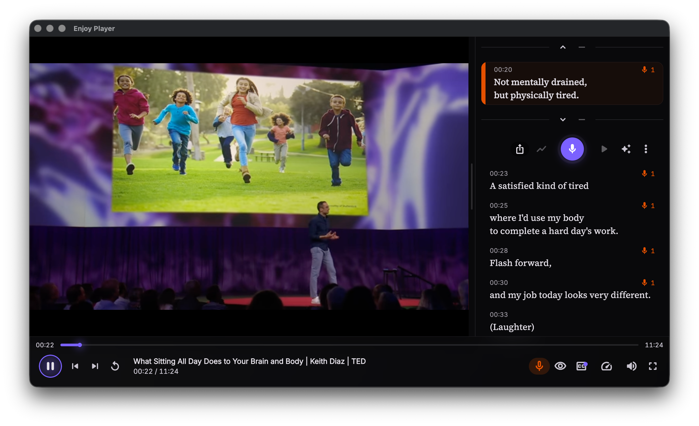

<p align="right">
  <a href="README.md">English</a> · <b>简体中文</b>
</p>

<p align="center">
  
</p>

<h1 align="center">Enjoy Player</h1>

<p align="center">
  <strong>用你喜欢的媒体学语言。</strong>
  <br>
  交互字幕、跟读模式、发音评分、间隔重复词汇本 —— 在你拥有的每一台设备上。
</p>

<p align="center">
  <a href="https://get.enjoy.bot"></a>
  <a href="https://github.com/an-lee/enjoy_player/releases/latest"></a>
  <a href="LICENSE"></a>
</p>

---

## 先看看效果

<table>
  <tr>
    <td align="center" width="25%"></td>
    <td align="center" width="25%"></td>
    <td align="center" width="25%"></td>
    <td align="center" width="25%"></td>
  </tr>
  <tr>
    <td align="center"><b>保持动力</b><br><sub>每日目标 · 社区 · 最近观看</sub></td>
    <td align="center"><b>逐字跟读</b><br><sub>点按跳转 · 跟读模式</sub></td>
    <td align="center"><b>说出地道发音</b><br><sub>Azure 发音评分</sub></td>
    <td align="center"><b>积累词汇</b><br><sub>查词 · 收藏 · 间隔重复复习</sub></td>
  </tr>
</table>

<p align="center">
  
</p>

<p align="center"><sub><b>一个体验，所有设备。</b>Windows、macOS、Linux、Android、iOS 全平台原生适配 —— 手机、平板、桌面端一致。</sub></p>

---

## 为什么选 Enjoy Player

**用你真正喜欢的内容学。** 导入你自己的 MP4 和音频文件，或粘贴任意 YouTube 链接 —— TED、Netflix、播客、动画都可以。字幕跟着你的媒体走，而不是反过来。

**第一天就开口说。** 跟读模式逐句播放、录制你的跟读，再用 Azure 语音从准确度、流利度、完整度、韵律四个维度为你打分。无需语伴也能练。

**词汇记得住。** 在字幕里选中任何单词 —— 立刻得到翻译、词典释义，再加上一句由 LLM 生成的"这句话在这段剧情里是什么意思"。一键加入按 SM-2 算法在你最容易遗忘的时刻复习的间隔重复卡片。

**一个 App，所有设备。** Windows、macOS、Linux、Android、iOS 全部原生适配。媒体库、学习进度、词汇本、设置在所有设备间无缝同步。

**持续练下去。** 每日练习目标、和你一起练的同好社区、看得见进步的统计 —— 一句一句、一天一天。

---

## 核心功能

- **交互字幕** —— 支持 `.srt` / `.vtt` 导入、AI 转写或 YouTube 字幕，自动同步。点行跳转，点词查义。
- **跟读模式（影子跟读）** —— 听一句、读一句、再听一次。播放器自动在跟读段末尾暂停、回退，让你可以反复打磨同一句。
- **发音评估** —— 原生 Azure 语音引擎，每次录音都给出总分及准确度 / 完整度 / 流利度 / 韵律的逐项评分，支持单词级细评与回放。
- **词典与上下文翻译** —— 在字幕中划词，即时得到翻译、词典释义，再加一句由 LLM 生成的"这句话在这段剧情里是什么意思"。
- **间隔重复词汇本** —— 三档评分闪卡（不认识 / 认识 / 很熟），按 SM-2 算法安排复习，每个词可绑定多个语境，Pro 用户可导出 Anki CSV。
- **YouTube 播放** —— 粘贴链接就能播，自动获取字幕、元数据，并渲染为交互字幕 —— 无广告、无自动续播的"惊喜"。
- **音高曲线分析** —— 用 YIN 算法把你的跟读录音与原句的语调叠在同一张图上，"哪里跑了调"一目了然。
- **练习海报** —— 把跟读片段生成一张 9:16 品牌海报（封面帧 + 台词金句 + 数据统计），一键分享到微信、X 等平台。
- **AI 逐句翻译** —— 按需逐句翻译，结果本地缓存；源文本变更时自动重译。
- **多设备同步** —— 媒体库、学习进度、词汇本、设置在登录同一 Enjoy 账号的所有设备间同步。

---

## 适配每一个屏幕

| 平台 | 原生体验 |
|------|----------|
| **Windows** | Windows 10 / 11 · x64 · 内置 FFmpeg，负责字幕与音高分析 |
| **macOS** | macOS 10.15+ · Universal 二进制 · 强化运行时 · 已公证 |
| **Linux** | Ubuntu 22.04 LTS · x86_64 · AppImage |
| **Android** | Android 8.0+ · 手机与平板 · Play 商店与 APK 直装 |
| **iOS** | iOS 14.0+ · iPhone 与 iPad · TestFlight 公测 |

刻意不提供 Flutter Web 版本。

---

## 立即获取

下载页会自动为你推荐适合当前系统的安装包：

**[get.enjoy.bot](https://get.enjoy.bot)**

| | |
|---|---|
| Windows | [下载 .exe](https://dl.enjoy.bot/player/) |
| macOS | [下载 .dmg](https://dl.enjoy.bot/player/) |
| Linux | [下载 .AppImage](https://dl.enjoy.bot/player/) |
| Android | [APK 直装](https://dl.enjoy.bot/player/) · [加入 Play Beta](https://play.google.com/) |
| iOS | [加入 TestFlight 公测](https://testflight.apple.com/) |

源码、版本与更新日志：**[github.com/an-lee/enjoy_player](https://github.com/an-lee/enjoy_player)**

---

## 开源 & 用心打造

- **播放器** —— [media_kit](https://pub.dev/packages/media_kit)，全应用唯一引擎（[ADR-0003](docs/decisions/0003-player-engine.md)）
- **状态管理** —— [Riverpod 3](https://pub.dev/packages/flutter_riverpod) + `riverpod_annotation`
- **存储** —— [Drift](https://pub.dev/packages/drift)（SQLite），所有持久化数据
- **语音** —— Azure 发音评估 + 原生 FFmpeg 音高分析
- **架构** —— 参见 [docs/architecture.md](docs/architecture.md)；设计决策见 [docs/decisions/](docs/decisions/)

---

## 从源码构建

```bash
flutter pub get
dart run build_runner build   # 修改 Drift / Riverpod 注解后需要执行
flutter run
```

平台工具链要点：macOS 需要 Xcode + CocoaPods + `brew bundle install --file=macos/Brewfile`；Windows 需要把 NuGet 加入 `PATH`（`flutter_inappwebview` 依赖）；Linux 需要 `clang cmake ninja-build libgtk-3-dev libsqlite3-dev ffmpeg`。完整前置条件与 CI 校验：[AGENTS.md](AGENTS.md)。

---

## 许可证

本项目以 [GNU Affero General Public License v3.0](LICENSE)（AGPL-3.0）发布。你可以阅读、派生、在其上构建，也可以运行你的修改版 —— 但凡通过网络向他人提供服务的，都必须同时提供对应的源代码。完整条款见 [LICENSE](LICENSE)。